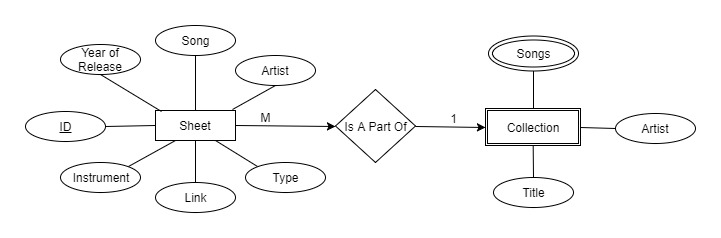

# 2.0 Detailed Database Design

## 2.1 Project Description
**Sheet Music Database** is a database that will store all varieties of sheet music. Using **PostgreSQL**, it will store files for musicians that want to keep all of their sheet music in one organized database.

## 2.2 Data Dictionary
### Sheet Table
##### *table that displays all sheets in the database*
+ ID: _a uniquely generated key for the specific sheet reference_
+ Song: _name of the song that the sheet is for_
+ Artist: _name of the artist or band that performs the song_
+ Year: _year that the song was released in_
+ Instrument: _the instrument the sheet music was written for_
+ Type: _whether or not the sheet is a tab, midi, guitar pro tab, or sheet music_
+ Link: _a link to the digital sheet file_

#### _Example._

| ID | Song | Artist | Year | Instrument | Type | Link |
|:--:|:----:|:------:|:----:|:----------:|:----:|:----:|
| K0O0K0ON | Sandmonster | Nick Johnston | 2013 | Guitar | GuitarPro | __Link__ |

### Collections table
##### *table that displays all albums/collections in the database*
+ Songs: _an array of the songs included in the collection_
+ Title: _title of the album/collection_
+ Artist: _artist who composed the album_

#### _Example._

| Songs | Title | Artist |
|:-----:|:-----:|:------:|
| {0O6K4602,27P64Z1K,QEO46D1L} | The Shape of Colour | Intervals |

## 2.3 Entity-Relationship Diagram

