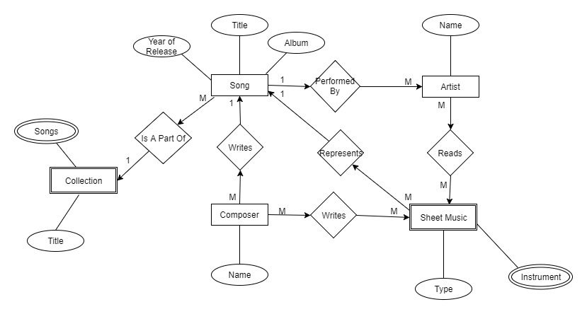

# 2.0 Detailed Database Design

## 2.1 Project Description
**Sheet Music Database** is a database that will store all varieties of sheet music. Using **PostgreSQL**, it will store files for musicians that want to keep all of their sheet music in one organized database.

## 2.2 Data Dictionary
### Song Table
##### *table that displays all songs in the database*
+ ID: _a uniquely generated key for the specific sheet reference_
+ Song Title: _name of the song that the sheet is for_
+ Artist Name: _name of the artist or band that performs the song_
+ Year of Song Release: _year that the song was released in_
+ Instrument: _the instrument the sheet music was written for_
+ Type of Sheet Music: _whether or not the sheet is a tab, midi, guitar pro tab, or sheet music_

#### _Example._

| ID | Song | Artist | Year | Instrument | Type |
|:--:|:----:|:------:|:----:|:----------:|:----:|
| 0000 | Transcription 1 | Nick Johnston |  2015 | Guitar | Guitar Pro |

### Collections table
##### *table that displays all albums/collections in the database*
+ Album/Collection: _album or collection that a set of songs belongs to_
+ Artist: _artist who performs the album_

#### _Example._

| Collection | Artist |
|:----------:|:------:|
| Atomic Improv Vol. 3 | Nick Johnston |

### Sheet Table
##### *table that displays all sheets and in the database and provides a link to obtain them*
+ ID: _a uniquely generated key for the specific sheet reference_
+ Song Title: _name of the song that the sheet is for_
+ Album/Collection: _album or collection that a set of songs belongs to_
+ Composer Name: _name of artist(s) that composed the song_
+ Instrument: _the instrument the sheet music was written for_
+ File: _a link to the digital sheet file_

#### _Example._

| ID | Song | Collection | Composer | Instrument | File |
|:--:|:----:|:----------:|:--------:|:----------:|:----:|
| 0000 | Transcription 1 | Atomic Improv Vol. 3 | Nick Johnston | Guitar | __Link__ |

## 2.3 Entity-Relationship Diagram

