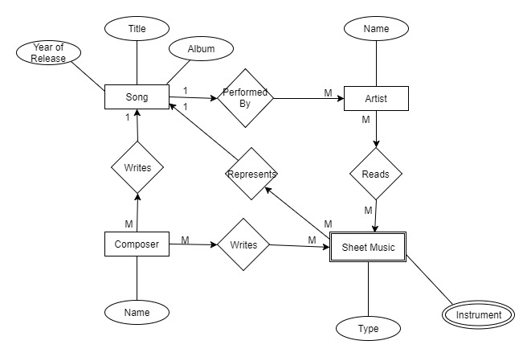

# 1.0 Preliminary Database Design

## 1.1 Project Description
**Sheet Music Database** is a database that will store all varieties of sheet music. Using **MySQL**, it will store files for musicians that want to keep all of their sheet music in one organized database.

## 1.2 Data Description
Sheet music may come in a variety of formats whether it be PDF (Portable Document Format) if it can be printed and read, or MIDI (Musical Instrument Digital Interface) which can only be viewed digitally. Sheet Music Database  will store these files as well as information regarding the artist, composer, song, and type of sheet music.

## 1.3 Types of Data
The data being stored will be the:
+ Song Title: _name of the song that the sheet is for_
+ Artist Name: _name of the artist or band that performs the song_
+ Composer Name: _name of artist(s) that composed the song_
+ Year of Song Release: _year that the song was released in_
+ Album/Collection: _album or collection that the song was a part of_
+ Instrument: _the instrument the sheet music was written for_
+ Type of Sheet Music: _whether or not the sheet is a tab, midi, guitar pro tab, or sheet music_

## 1.4 Preliminary Schema
The database will have a main table with columns: Index, Song, Artist, Collection, Year, Instrument, and Type.
The primary key of the table will be the index. This will be a number generated based on when the file was first placed into the database For example:

| Index | Song | Artist | Collection | Year | Instrument | Type |
|:-----:|:----:|:------:|:----------:|:----:|:----------:|:----:|
| 0 | I'm a song | Me | An Album | 1969 | Kazoo, Piano| Sheet |
_[For the time being this the best solution I can think of to the problem that only a combination of inputs in columns can actually uniquely identify a row]_.

## 1.5 Entity-Relationship Diagram

